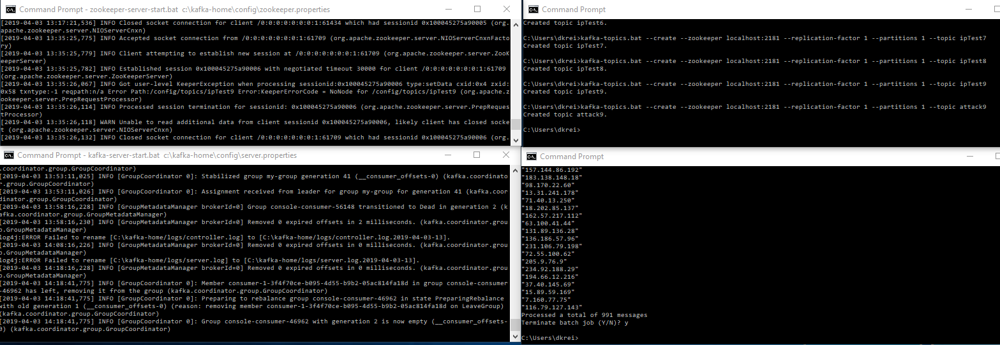
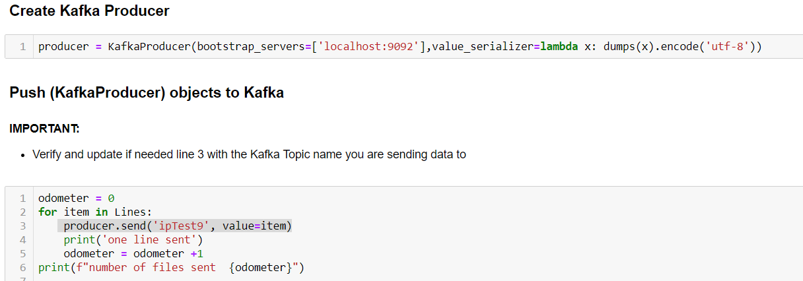
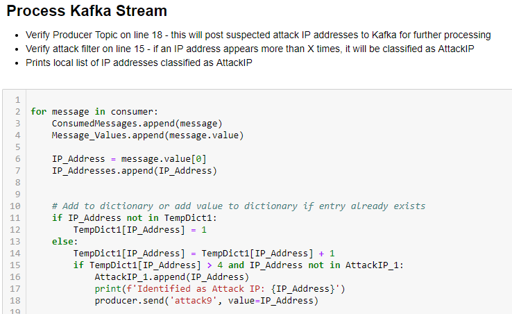

# Kafka_DDoS_Analysis

## Purpose:
Create a program to simulate a real-time detector of Distributed Denial of Service (DDoS) attacks. 

## Kafka Info
Apache Kafka is a distributed streaming platform. For more information on Kafka visit <a href="https://kafka.apache.org/">Apache-Kafka</a>  
Learning Journal has an <a href="https://www.learningjournal.guru/courses/kafka/kafka-foundation-training/">Apache Kafka Foundation Course</a> that I found to be incredibly helpful with installing Kafka on Windows 10, testing a local enviornment, and understanding how to create a Producer and Consumer.  Although the course introduces you to kafka using Java, I found it incredibly helpful even though I didn't know any Java when I started the course.

### Install Kafka-python

`pip install kafka-python`  

There are a few good resources for Kafka-Python, here are two that I used:  
The official kafka-python docs - <a href="https://kafka-python.readthedocs.io/en/master/usage.html#kafkaconsumer">kafka-python Read the Docs</a>  
Kafka-Python explained in 10 lines of code - <a href="https://towardsdatascience.com/kafka-python-explained-in-10-lines-of-code-800e3e07dad1">Medium Article by Steven Van Dorpe.</a> 

### Instructions to run the Notebooks

#### Start Apache Zookeeper
 - `zookeeper-server-start.bat <path to zookeeper.properties>`
 - `zookeeper-server-start.bat c:\kafka-home\config\zookeeper.properties`

#### Start Apache Kafka
- `kafka-server-start.bat <path to kafka server.properties>`
- `kafka-server-start.bat c:\kafka-home\config\server.properties`

#### Create 1st Topic
- The `topic` is where messages will be sent before any classification.
- `kafka-topics.bat --create --zookeeper localhost:2181 --replication-factor 1 --partitions 1 --topic test`

#### Start Producer (optional for local enviornment testing)
- `kafka-console-producer.bat --broker-list localhost:9092 --topic test`

#### Start Consumer (optional for local enviornment testing)
- `kafka-console-consumer.bat --bootstrap-server localhost:9092 --topic test -- from-beginning`
- Make sure you are using the same topic for the Producer and Consumer, and that the Topic was created...

#### Kafka_Producer.ipynb
- This notebook reads a local text file, parses and converts each line into an object (array), and pushes it to Kafka.
- Make sure both Zookeeper and Kafka Server are running before trying to push.
- Make sure you update/verify the Producer Topic variable so you know where the info is being pushed.

#### Kafka_consumer-processing-producing.ipynb
- This notebook consumes a Kafka topic, counts how many times each IP address appears in the stream, classifies IP addresses as possible attackers, and pushes (KafkaProduce) classified IP addresses to a new Kafka topic.
- Run this notebook after the Kafka_Producer.ipynb.

### Instructions to run the app.py
Coming Soon!
